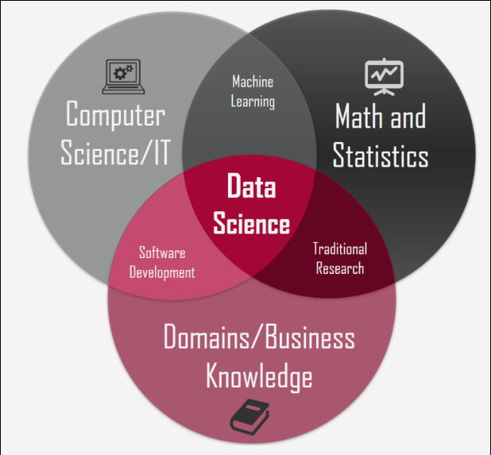
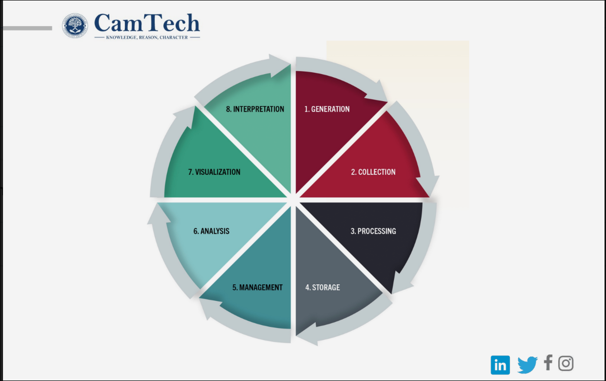
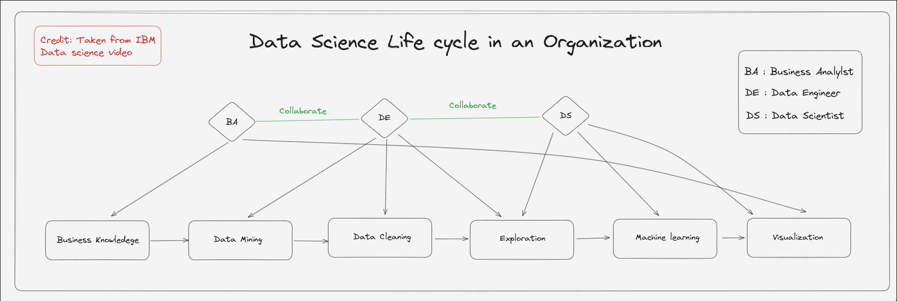

# Data science Introduction

## Definition
Data science is a discipline that works on using raw data to extract valuable insights. The discipline encapsulate many other skills
from different area such as programming, statistics, machine learning and data analysis. The knowledeged will be converted to actions
that can be taken by an organization such as company ,agency or government body.

Data science skill is an intersection between computer science ,math and domain knowledge.

## Data life cycle
Data must be handle in a correct lifecycle in order to extract correct insight after processing.

## Type of data science
There are 4 types of data science :

- Descriptive analytic : describe the situation in an organization via accurate data
- Diagnostic analytic : trying to find the root cause of the problem in an organization
- Predictive analytic : trying to predict the next outcome via data pattern as well as the current situation
- Perscriptive analytic : provide actionable recommendation to avoid / solve current problem, aspects that need to be improved on
to achieve a specific outcome

## Data science life cycle

## Definitions resource:
[Awesome video explained by IBM](https://www.youtube.com/watch?v=RBSUwFGa6Fk)
[Well-made one by JOMA](https://www.youtube.com/watch?v=xC-c7E5PK0Y)
[Good comparation of Data science vs Data analytics](https://www.youtube.com/watch?v=dcXqhMqhZUo)

## Materials :
### Technologies to learn :
- numpy: process matrix and perform mathematical equation more efficieintly.
- mathplotlib: plot and visualize data.
- jupyter notebook: interactive coding environment
- scikit-learn: simple tools for predictive modelling and data analysis.

### Concepts to learn and revisit :
- linear algebra
- matrix transformation
- derivative and integrations
- statistics concept (p-value,z-score,correlation,statiscal significane,std...)
- proposal and recommendation writings

## Notes :
- Assignment in the class is expected to be around 10-15 hours per week.
- Would need to complete data-camp courses
